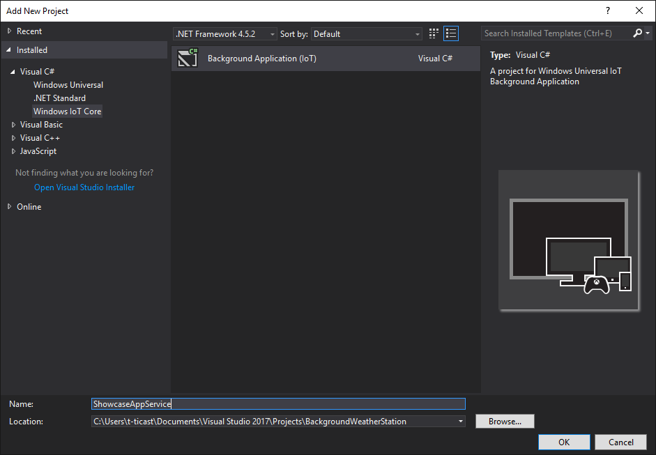

---
---
# Creating an app service

## Introduction

An app service allows an application to advertise services for other apps. We will create an app service on the background app. The background and foreground apps will connect to the app service to exchange data (e.g. sensor data and Azure settings).


The app service could also be placed on the foreground app. Foreground applications also support [in-process app services](https://docs.microsoft.com/en-us/windows/uwp/launch-resume/convert-app-service-in-process), which are simpler to create.

## Creating an app service

Whenever some app connects to the app service, a background task is started to handle the connection. We will base our app service on the background app template.

* Create a new project named *ShowcaseAppService* using the *Background Application (IoT)* template.



* Place the following code in `StartupTask.cs`. It's a service that does nothing other than printing to Debug output:

```cs
using Windows.ApplicationModel.Background;
using System.Diagnostics;

namespace ShowcaseAppService
{
    public sealed class StartupTask : IBackgroundTask
    {
        public void Run(IBackgroundTaskInstance taskInstance)
        {
            Debug.WriteLine("Sample app service");
        }
    }
}
```

* In the *ShowcaseAppService* project, erase the generated *Package.appxmanifest*. Edit the *Package.appxmanifest* file in the *BackgroundWeatherStation* project and add the following to the `Extensions` block:

```xml
<uap:Extension Category="windows.appService" EntryPoint="ShowcaseAppService.StartupTask">
  <uap:AppService Name="com.microsoft.showcase.appservice" />
</uap:Extension>
```

* Right click the *ShowcaseAppService* project and select *Unload Project*. Right click and choose *Edit ShowcaseAppService.csproj*. Comment the following lines:

```xml
<PackageCertificateKeyFile>ShowcaseAppService_TemporaryKey.pfx</PackageCertificateKeyFile>
<AppxPackage>true</AppxPackage>
<ContainsStartupTask>true</ContainsStartupTask>
```

Reload the project (*Right click -> Reload Project*). Find the Package Family Name (PFN) of your background app package. You can find it by one of the following:

1. If you app is associated with the Store, [see this guide to find it on the app registration page](../StoreDeployment/README.md).
2. Deploy the app and see the PFN on the Build Output window:

3. Write the value of `Windows.ApplicationModel.Package.Current.Id.FamilyName` to debug output and take note of it.

* Create a `AppServiceConnectionFactory` class. It will return connections to the app service. You will connect to a given app service in a PFN:

```cs
using Windows.ApplicationModel.AppService;

namespace BackgroundWeatherStation
{
    public sealed class AppServiceConnectionFactory
    {
        public static AppServiceConnection GetConnection()
        {
            AppServiceConnection connection = new AppServiceConnection()
            {
                AppServiceName = "com.microsoft.showcase.appservice",
                PackageFamilyName = "<Package Family Name goes here>"
            };
            return connection;
        }
    }
}
```

* Create an `AppServiceBridge.cs` class. It handles the reconnection cycle in case the connection is closed. [The code for the class is available here.](https://github.com/ms-iot/devex_project/blob/master/CS/BackgroundWeatherStation/AppServiceBridge.cs) It mostly forwards calls to the underlying `AppServiceConnection`.

> Being fault tolerant in the connection is desirable. Our app should be able to reconnect and keep working if the app service crashes or closes the connection.

* In your background application, add a call to `await AppServiceBridge.InitAsync();` to the `Run` method of the `StartupTask`. For example, the following class would start and connect to the app service:

```cs
using Windows.ApplicationModel.Background;

namespace BackgroundWeatherStation
{
    public sealed class StartupTask : IBackgroundTask
    {
        private BackgroundTaskDeferral _deferral;

        public async void Run(IBackgroundTaskInstance taskInstance)
        {
            _deferral = taskInstance.GetDeferral();
            await AppServiceBridge.InitAsync();
        }
    }
}
```

* Run the code and the message will appear on the *Debug Output* window.

## Long live the app service!

An app service might do short-lived tasks, but can also be used for long interprocess communication (IPC). In the showcase project, the foreground and background apps will remain connected to the app service throughout their lifetime. IPC communication happens through messages that get send to the app service and get received through callbacks. We will now do the required changes to make a long lived app service.

Just like we did with the background application, we have to grab a deferral in the `Run` method of the `StartupTask`, else the system will consider that the app is done once this method returns. A very relevant detail of app services is that it must listen for cancellation events and release the deferral. If the application on the other end closes the connection, the app service will receive a cancellation event with reason `ResourceRevocation`, letting it know the it must finish soon. If it doesn't, it's considered to be in a bad state and its process will be killed, since by design app services exist only to provide services to other applications.

> If the app service does not respond to cancellation events (does not release the deferral within 5 seconds), its process (including the background app) will be killed.

An example of what a complete `StartupTask.cs` for an app service looks like is:

```cs
using Windows.ApplicationModel.Background;
using System.Diagnostics;
using Windows.ApplicationModel.AppService;

namespace ShowcaseAppService
{
    public sealed class StartupTask : IBackgroundTask
    {
        private BackgroundTaskDeferral _deferral;
        private AppServiceConnection _connection;

        public void Run(IBackgroundTaskInstance taskInstance)
        {
            taskInstance.Canceled += OnTaskCanceled;
            Debug.WriteLine($"ShowcaseBridgeService FamilyName: {Windows.ApplicationModel.Package.Current.Id.FamilyName}.");

            if (SetupConnection(taskInstance.TriggerDetails as AppServiceTriggerDetails))
            {
                _deferral = taskInstance.GetDeferral();
            }
        }

        private bool SetupConnection(AppServiceTriggerDetails triggerDetails)
        {
            if (triggerDetails == null)
            {
                Debug.WriteLine("ForegroundBridgeService started without details, exiting.");
                return false;
            }
            if (!triggerDetails.Name.Equals("com.microsoft.showcase.appservice"))
            {
                Debug.WriteLine("Trigger details name doesn't match com.microsoft.showcase.bridge, exiting.");
                return false;
            }
            Debug.WriteLine("New service connection.");
            _connection = triggerDetails.AppServiceConnection;
            _connection.RequestReceived += OnRequestReceived;

            return true;
        }

        private void OnTaskCanceled(IBackgroundTaskInstance sender, BackgroundTaskCancellationReason reason)
        {
           Debug.WriteLine($"Cancellation, reason: {reason}.");
           if (_deferral != null)
           {
               _deferral.Complete();
           }
        }

        private void OnRequestReceived(AppServiceConnection sender, AppServiceRequestReceivedEventArgs args)
        {
            Debug.WriteLine("App service request received.");
        }
    }
}
```
