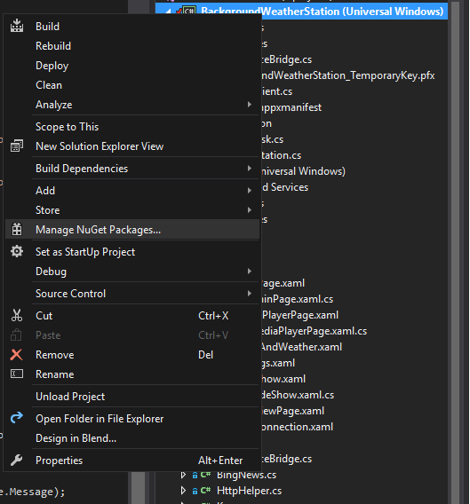
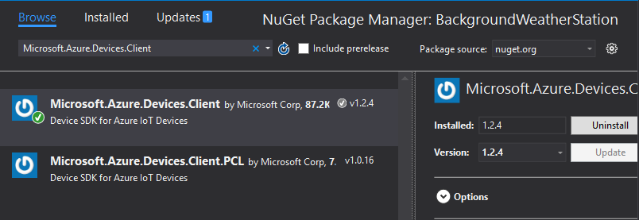
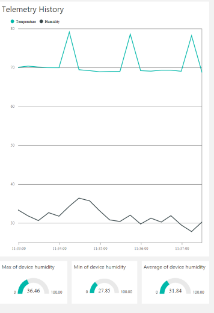

---
---
# Connecting to an Azure IoT Hub using the Preconfigured Remote Monitoring solution

## Introduction

The Preconfigured Remote Monitoring solution is an Azure sample usage of the IoT Hub. Creating a Preconfigured Remote Monitoring solution will create an IoT Hub and a few complementary services (such as a web management interface) to ease the development of IoT applications. We will log data to the Azure cloud and visualize it in the solution dashboard.

If you want to create IoT utilities to communicate with Azure and visualize data from scratch, you can base your code on the [Preconfigured Remote Monitoring solution](https://github.com/Azure/azure-iot-remote-monitoring).

## Creating Azure resources and connecting to the IoT Hub

Follow the steps outlined at [Provision the solution](https://docs.microsoft.com/en-us/azure/iot-suite/iot-suite-getstarted-preconfigured-solutions#provision-the-solution). If you're not using the IoT Hub on a production scenario, it is recommended that you follow [these steps](https://github.com/Azure/azure-iot-remote-monitoring/blob/master/Docs/configure-preconfigured-demo.md) to make the Azure services subscriptions cheaper.

[Follow these steps](https://docs.microsoft.com/en-us/azure/iot-suite/iot-suite-connecting-devices) to create a new device ID and key in the solution dashboard.

We will use the [Microsoft.Azure.Devices.Client](https://www.nuget.org/packages/Microsoft.Azure.Devices.Client/) library to connect to Azure, which eases the connection to Azure IoT. Before starting, install the library to the background app project using NuGet:

* Open NuGet by right-clicking the BackgroundWeatherStation project.

* Search for `Microsoft.Azure.Devices.Client` and click install.


We will create a class to handle the connection to Azure and data logging. This class will have the device identity and key hardcoded in the application. For production scenarios, the ID and key should be saved in the TPM; [see this page for information on secure storage of keys](../../Security/TPM/README.md).

Add a `IoTHubClient.cs` class to the BackgroundWeatherStation project. Connecting to Azure using the Devices.Client library is easy:

```cs
using Microsoft.Azure.Devices.Client;
using System;
using System.Diagnostics;
using System.Text;
using System.Threading.Tasks;
using Windows.Data.Json;

namespace BackgroundWeatherStation
{
    class IoTHubClient
    {
        private DeviceClient _deviceClient;
        private readonly String HOSTNAME = "<your hostname>";
        private readonly String ID = "<your ID>";
        private readonly String KEY = "<your key>";

        public IoTHubClient()
        {
            _deviceClient = DeviceClient.Create(HOSTNAME, new DeviceAuthenticationWithRegistrySymmetricKey(ID, KEY));
        }
    }
}
```

Next, add the following function to send data to Azure as a JSON document:

```cs
public async Task LogDataAsync(double temperature, double humidity, double pressure)
{
    var messageString = new JsonObject
    {
        { "currentTemperature", JsonValue.CreateNumberValue(temperature) },
        { "currentHumidity", JsonValue.CreateNumberValue(humidity) },
        { "currentPressure", JsonValue.CreateNumberValue(pressure) },
        { "deviceId", JsonValue.CreateStringValue(ID) },
        { "time", JsonValue.CreateStringValue(DateTime.Now.ToString()) },
    }.Stringify();
    var message = new Message(Encoding.ASCII.GetBytes(messageString));

    try
    {
        await _deviceClient.SendEventAsync(message);
    }
    catch (Exception e)
    {
        Debug.WriteLine("Error logging data to Azure:\n" + e.Message);
    }
}
```

The `StartupTask.cs` file will also be changed to create an instance of `IoTHubClient` and send data through it:

```cs
using System;
using Windows.ApplicationModel.Background;
using Windows.System.Threading;
using System.Diagnostics;

namespace BackgroundWeatherStation
{
    public sealed class StartupTask : IBackgroundTask
    {
        private BackgroundTaskDeferral _deferral;
        private ThreadPoolTimer _timer;
        private WeatherStation _weatherStation = new WeatherStation();
        private IoTHubClient _iotHubClient = new IoTHubClient();

        public async void Run(IBackgroundTaskInstance taskInstance)
        {
            _deferral = taskInstance.GetDeferral();
            try
            {
                await _weatherStation.InitAsync();
            }
            catch (Exception e)
            {
                Debug.WriteLine("I2C initialization failed: " + e.Message);
                _deferral.Complete();
                return;
            }
            _timer = ThreadPoolTimer.CreatePeriodicTimer(LogSensorData, TimeSpan.FromSeconds(5));
        }

        private async void LogSensorData(ThreadPoolTimer timer)
        {
            await _iotHubClient.LogDataAsync(_weatherStation.ReadTemperature(), _weatherStation.ReadHumidity(), _weatherStation.ReadPressure());
        }
    }
}
```

When run, project will log to the solution dashboard:



**Note:** Keys hardcoded in the application are not secure. After done testing communication with Azure, you should proceed to [Saving Azure keys to the TPM module and connecting with tokens](../../Security/TPM/README.md)
