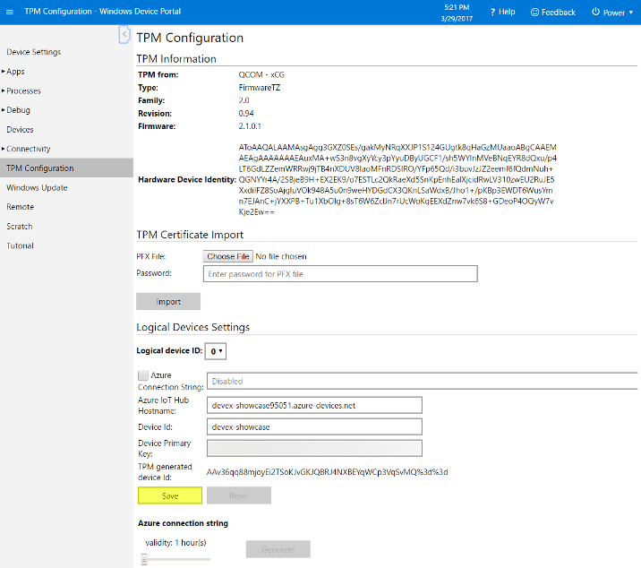

---
---
# Saving Azure keys to the TPM module and connecting with tokens

## Introduction

The Trusted Platform Module (TPM) is a chip for safe storage of private keys and generation of tokens. It is meant to be hard to tamper with, making it hard to recover saved private keys. The generated tokens have a short validity, reducing the security impact in case they are leaked.

Using a TPM to connect to Azure makes your application safer, since keys won't be hardcoded in your application but instead saved to the TPM.

## Tools

You will need an IoT Hub. Following the [Azure IoT Suite preconfigured solution](https://docs.microsoft.com/en-us/azure/iot-suite/iot-suite-getstarted-preconfigured-solutions) will create one automatically.

## Configuring the TPM

Open the device portal (`http://<your device IP>:8080`) in a browser. Click *TPM Configuration* and paste the hostname, device ID and primary key in the respective fields. Click *Save*.



The data is now saved in the TPM. The ID and hostname can be read in our application, but the private key is locked; the TPM will only provide temporary tokens for our application based on the primary key.

Our previous `IoTHubClient.cs` code will be changed slightly to use the TPM keys. The class will have a few more instance variables to store an instance of the TPM and the device ID:

```cs
class IoTHubClient
{
    private TpmDevice _tpm = new TpmDevice(0);
    private DeviceClient _deviceClient;
    private String _id;

    public IoTHubClient()
    {
        _id = _tpm.GetDeviceId();
        RefreshToken();
    }
}
```

A `RefreshToken` method will be added to get a new authentication token:

```cs
private void RefreshToken()
{
    var method = AuthenticationMethodFactory.CreateAuthenticationWithToken(_id, _tpm.GetSASToken());
    _deviceClient = DeviceClient.Create(_tpm.GetHostName(), method, TransportType.Amqp);
}
```

Whenever we get an `UnauthorizedException` during a `SendEventAsync` call, we should refresh the token and retry. Depending on your project and the importance of the Azure operation being done, more measures should be taken to make the cloud communication more reliable. The *BackgroundWeatherStation* in the showcase project uses a `SemaphoreSlim` around Azure operations to avoid refreshing the connection while a transfer is in place and keeps a queue of failed operations and retries them using `SendEventBatchAsync`, so that short disconnections don't discard data. <a href="https://github.com/ms-iot/iot-walkthrough/blob/master/CS/BackgroundWeatherStation/IoTHubClient.cs" target="_blank">The class used in the project is available here.</a>
