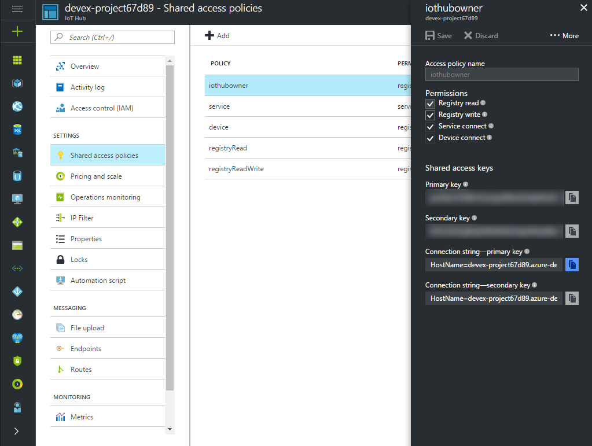
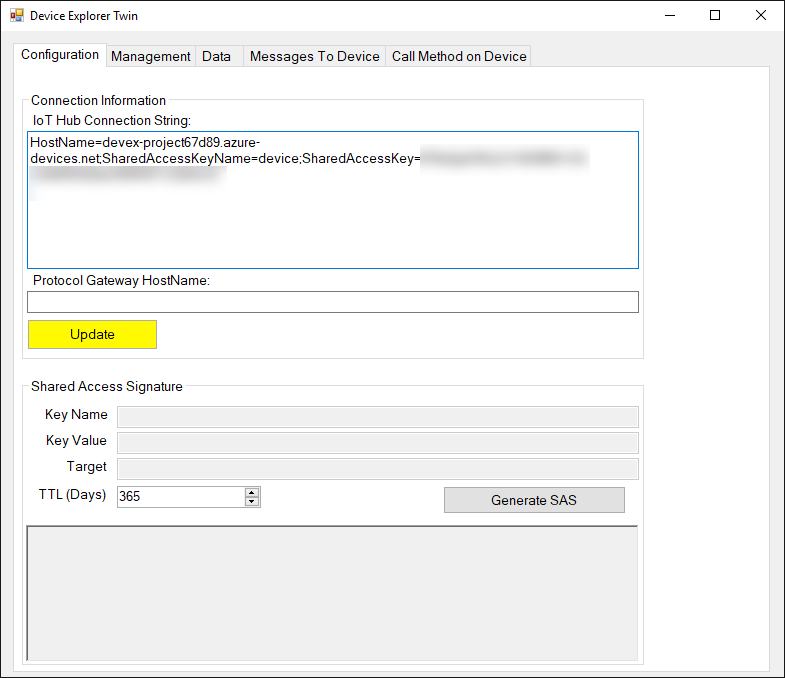
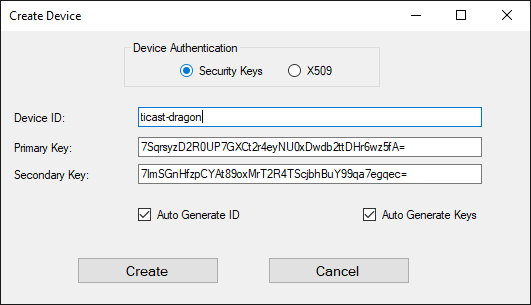
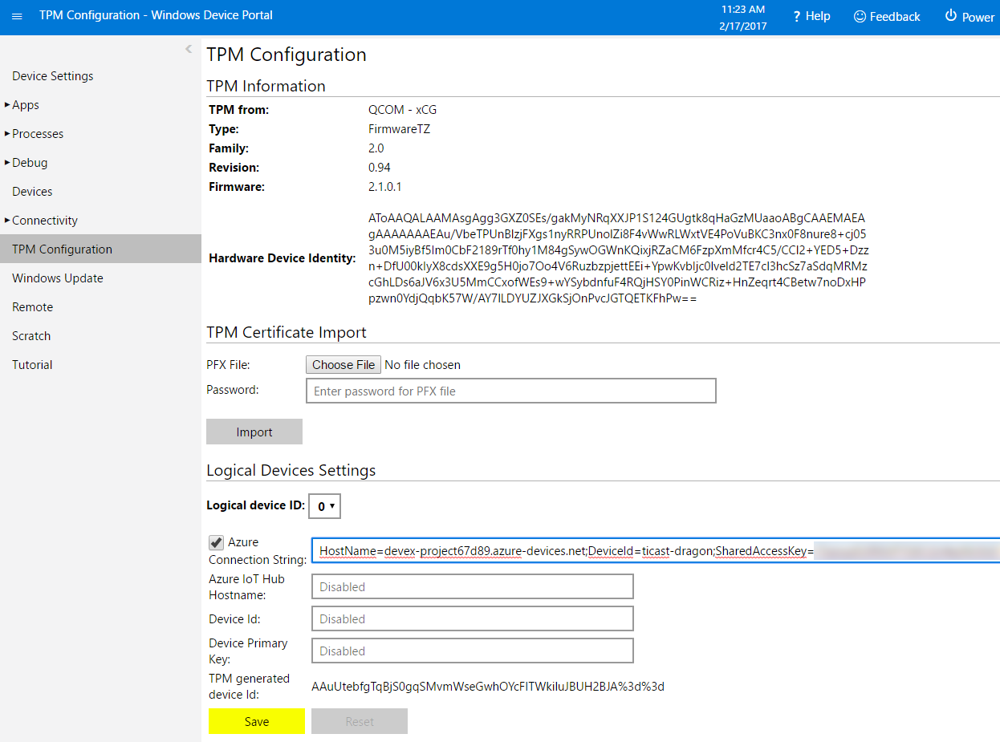

---
---
# Saving Azure keys to the TPM module and connecting with tokens

## Introduction

The Trusted Platform Module (TPM) is a chip for safe storage of private keys and generation of tokens. It is meant to be hard to tamper with, making it hard to recover saved private keys. The generated tokens have a short validity, reducing the security impact in case they are leaked.

Using a TPM to connect to Azure makes your application safer, since keys won't be hardcoded in your application but instead saved to the TPM.

## Tools

You will need an IoT Hub. Following the [Azure IoT Suite preconfigured solution](https://docs.microsoft.com/en-us/azure/iot-suite/iot-suite-getstarted-preconfigured-solutions) will create one automatically.

[The Device Explorer application](https://github.com/Azure/azure-iot-sdks/releases) will be used to generate the TPM keys.

## Connecting the Device Explorer to the IoT Hub

[Open the Azure portal](https://ms.portal.azure.com/) and click the IoT Hub resource, highlighted in yellow in the image below:


In the IoT Hub, click *Shared access policies* and choose the *iothubowner* policy. Copy the connection string for the primary key.



Open the Device Explorer on your PC. On the *Configuration* tab, paste the connection string in the *IoT Hub Connection String* field, and click update.



Go to the *Management* tab and click *Create*. Use *Security Keys* as the Device Authentication, choose an ID (or check *Auto Generate ID*) and use the auto generated keys. Click *Create*.



Right click the newly created device and click *Copy connection string for selected device*.


Open the device portal (`http://<your device IP>:8080`) in a browser. Click *TPM Configuration* and paste the connection string to *Azure Connection String*. Click *Save*.



The device's private key, ID and connection hostname are now saved in the TPM. The ID and hostname can be read in our application, but the private key is locked; the TPM will only provide temporary tokens for our application.

Our previous `IoTHubClient.cs` code will be changed slightly to use the TPM keys. The class will have a few more instance variables to store an instance of the TPM and the device ID:

```cs
class IoTHubClient
{
    private TpmDevice _tpm = new TpmDevice(0);
    private DeviceClient _deviceClient;
    private String _id;

    public IoTHubClient()
    {
        _id = _tpm.GetDeviceId();
        RefreshToken();
    }
}
```

A `RefreshToken` method will be added to get a new authentication token:

```cs
private void RefreshToken()
{
    var method = AuthenticationMethodFactory.CreateAuthenticationWithToken(_id, _tpm.GetSASToken());
    _deviceClient = DeviceClient.Create(_tpm.GetHostName(), method, TransportType.Amqp);
}
```

Whenever we get an `UnauthorizedException` during a `SendEventAsync` call, we should refresh the token and retry. <a href="https://github.com/ms-iot/devex_project/blob/master/CS/BackgroundWeatherStation/IoTHubClient.cs" target="_blank">The updated class is available here.</a>
